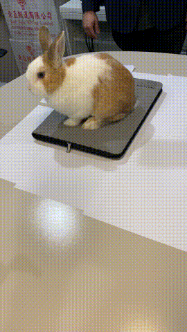

# 3D Reconstruction Pipeline Pet Project

This is a pet project for a 3D reconstruction pipeline using ODM (OpenDroneMap) as the core process.

## Demo

Input: video of an object



(this is one of many angles of the rabbit)

Output: .glb/.obj


## Installation

To get started with the project, follow the steps below:

### Conda Environment

1. Install Anaconda or Miniconda, if not already installed.

2. Create a suitable Conda environment using the provided environment file:
```
conda env create -f environment.yml
```

## Folder Structure

Follow the directory hierarchy below for organizing your project files:
```
- scripts_odm
- projects
  - [project_name]
    - datasets
      - 0001.mp4
      - 0002.jpg
      - ...
```
## Running the Project
Navigate to the **scripts_odm** folder in your terminal.

Run the following command to execute the project:
```
python run.py project_name
```
A series of customizable options is available with ```python run.py -h```:

```
usage: run.py [-h] [-m] [-m2] [-s SERVER] [-t] [-f FRAMES] [-r RESOLUTION] [-o OUTPUTMESH] [-pq PC_QUALITY]
              [-fq FEATURE_QUALITY] [--norerun] [-sr] [-ot OCTREE] [-kf] [-ap ADDITIONAL] [--override OVERRIDE]
              [--aws] [-pp] [--start START]
              projectname

Run ODM with python scripts

positional arguments:
  projectname

optional arguments:
  -h, --help            show this help message and exit
  -m, --mask            use mask [True, False*]
  -m2, --mask2          use Mask2Former (experimental) [True, False*]
  -s SERVER, --server SERVER
                        timestamp from server. Toggle server mode. Default None
  -t, --test            toggle test, override other settings [True, False*]
  -f FRAMES, --frames FRAMES
                        no. of frames from video. Default 70
  -r RESOLUTION, --resolution RESOLUTION
                        target resolution of frames in MP, use 0 as original. Default 2
  -o OUTPUTMESH, --outputmesh OUTPUTMESH
                        output mesh no. of face. Default 15000
  -pq PC_QUALITY, --pc-quality PC_QUALITY
                        pc-quality [ultra, high, medium*, low, lowest].
  -fq FEATURE_QUALITY, --feature-quality FEATURE_QUALITY
                        feature-quality [ultra*, high, medium, low, lowest]
  --norerun             do not rerun pipeline. Default False (rerun)
  -sr                   run super-resolution to x4
  -ot OCTREE            octree_depth default 7
  -kf                   keep-unseen-face detault false
  -ap ADDITIONAL, --additional-parameters ADDITIONAL
                        additional parameters as string
  --override OVERRIDE   custom parameters, override all
  --aws                 use aws fargate to do processing
  -pp                   Preprocess only. Do not run ODM
  --start START         starting phase.
                        (dataset|opensfm|openmvs|odm_filterpoints|odm_meshing|mvs_texturing|odm_report). Default ""
```

Happy coding!
